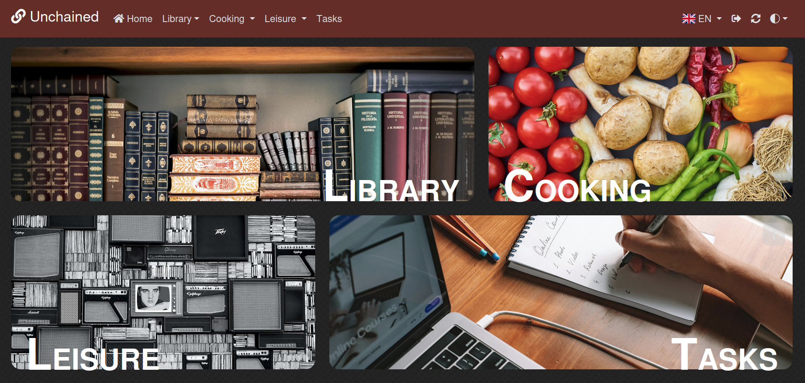

Unchained
====

Unchained is a high-level list-keeping CMS for keeping track of your favorite \<insert here\>. With Unchained you can keep a variety of records, maintaining interoperable lists (cross-references) using simple (readable) configurations.
 
[Read the wiki](https://github.com/vpmv/unchained-cms/wiki)



# About
Everyone has hobbies! Keep track of your sports performance, your favorite movies, your best recipes, books and inventory ~ whatever! Unchained allows you to easily create multiple apps, with cross-references, without any programming knowledge. 
No need to get your hands dirty with databases either; Unchained has this on board. All you need to do is create a few text files.

Unchained comes with a few simple examples to help you get started.

# Installation

Use the official PHP-FPM image:

```shell
docker run \
  -v build:/var/www/public/build \
  -v media:/var/www/public/media \
  -v ./user:/var/www/user \
  ghcr.io/vpmv/unchained-cms:latest
```

```yaml
# docker-compose.yaml
services:
  php:
    image: ghcr.io/vpmv/unchained-cms:latest 
    volumes:
      - build:/var/www/public/build
      - media:/var/www/public/media
      - ./user:/var/www/user # your local user configuration / customization   
```

For detailed and bare-metal installations, please read the [Installation guide](https://github.com/vpmv/unchained-cms/wiki/installation)


# User configuration
The user directory is the starting point of your applications. Unchained will look here first for configurations, templates and extensions.

The user directory is designed to be used as a Docker binding and/or as a nested repository. This way you can keep the (development) core updated whilst maintaining the freedom within your own configurations.

Read the wiki on how to [Configure and use your first app](https://github.com/vpmv/unchained-cms/wiki/applications)


## Customization

Unchained is easily extended with Webpack Encore, Twig and user-defined PHP extensions. The front-end entrypoint is preconfigured at `/user/assets/user.js`. <br> Feel free to add your own scripts and styling.

Unchained comes with the following Icon packs:
* FontAwesome 7
* Bootstrap Icons 1.13 

Templates are easily overridden. See [the sources](templates) for templates you wish to override and put them in `/user/templates`.

Read the wiki on how to [extend your applications](https://github.com/vpmv/unchained-cms/wiki/configuration#pointers)


# Features
 * [x]  Easy zero-knowledge text-based (YAML) configuration 
 * [x]  Highly customizable front-end
     * **New in v1.2**: Two built-in styles (textual/blocky)
     * **New in v1.2**: Themes (dark/light/auto)
 * [x]  Public / private views with admin backend
     * Configure which apps / fields are publicly visible
 * [x]  Link applications with each other, cross-referencing values<br>
     * Count foreign records
     * **New in v1.2**: find min/max dates & show averages
     * **New in v1.2**: grouping and conditional form elements
 * [x]  Customize data output by referencing values, through user written code
     * **New in v1.2**: Helper functions and example scripts to help you get started 
 * [x]  Extend or replace templates
 * [x]  Native customizable/extendable styling using Webpack standards 
 * [x]  Translation support
    Unchained comes preconfigured with a bunch of translations. Each application allows for their own translations.
 * [x]  Application categorization
     * Easily define categories with automatic routing 
 
 ## Roadmap

 * [ ]  Installation wizard
 * [ ]  Prettier forms
 * [ ]  Graphs; get a clearer overview of your progression (useful for sports, psychology, etc.)
